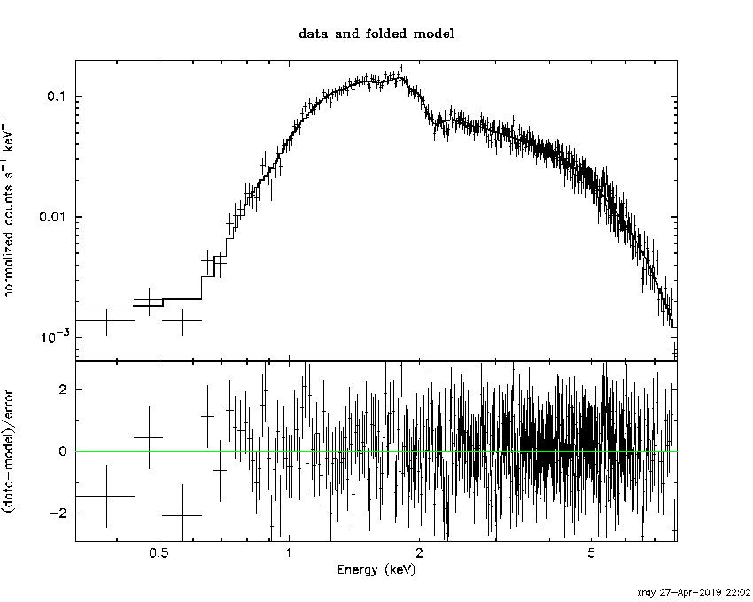

## E01_spectrum

### 对已知模型的能谱进行拟合练习

#### a.pi

$\chi ^2=353.35$，自由度$N=390$ 

$nH=1.05230\times 10^{2}$ atoms cm$^{-2}$

光度$L=4\pi d^2 S$ 

#### b.pi

$\chi ^2=353.35$，自由度$N=390$ 

#### c.pi

$\chi ^2=353.35$，自由度$N=390$ 

#### d.pi

$\chi ^2=353.35$，自由度$N=390$ 

#### e.pi+f.pi

$\chi ^2=353.35$，自由度$N=390$ 

### Chandara能谱分析

## E02_timing